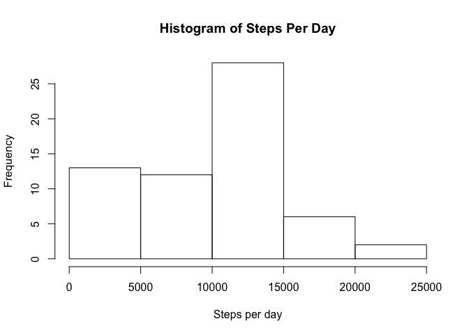
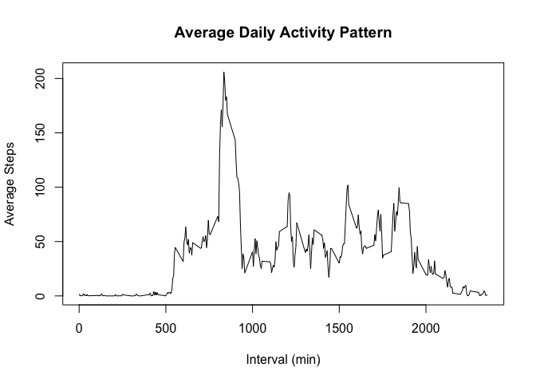
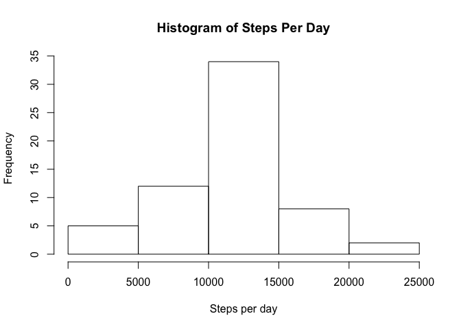
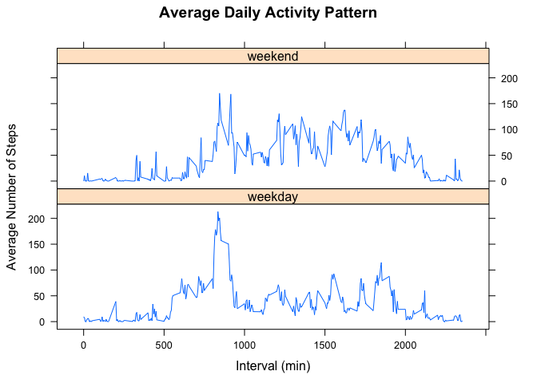

# Reproducible Research: Peer Assessment 1


## Loading the ggplot2 and dplyr packages 

```r
library(ggplot2)
library(dplyr)
```

## Loading and preprocessing the data
We load the data firstly.

```r
dat <- read.csv("activity.csv")
```

## What is mean total number of steps taken per day?
The total steps per day are calculated by grouping by date and summarise the group by summing steps for each day. A histogram is plotted.

```r
dat1 <- dat %>% group_by(date) %>% summarise(total.perday = sum(steps, na.rm=T))
summary(dat1$total.perday, na.rm=T)
```

```
##    Min. 1st Qu.  Median    Mean 3rd Qu.    Max. 
##       0    6778   10400    9354   12810   21190
```

```r
hist(dat1$total.perday, xlab="Steps per day", main="Histogram of Steps Per Day")
```

<!-- -->
  
The mean and the median total number of steps are 9354 and 10400 steps, respectivley.

## What is the average daily activity pattern?
1. Using the following code, we created a time series plot of the 5-minute interval (x-axis) and the average number of steps taken, averaged across all days (y-axis). The daily activity is most intense between 500 and 2000 mins.

```r
dat2 <- dat %>% group_by(interval) %>% summarise(ave = mean(steps, na.rm=T))
plot(dat2$interval,dat2$ave, type = "l", xlab = "Interval (min)", ylab= "Average Steps", main="Average Daily Activity Pattern" )
```

<!-- -->

2. We can also find the 835th 5-minute interval contains the maximum number of steps.

```r
dat2$interval[which.max(dat2$ave)]
```

```
## [1] 835
```
## Imputing missing values
1. We calculate and find the total number of missing values in the database is 2304.

```r
sum(is.na(dat$steps))
```

```
## [1] 2304
```

```r
sum(is.na(dat$date))
```

```
## [1] 0
```

```r
sum(is.na(dat$interval))
```

```
## [1] 0
```

2. Because there are missing steps in the data, we can impute the missing data using predictive mean matching method (pmm) via Mice package in R. See [this page](https://www.analyticsvidhya.com/blog/2016/03/tutorial-powerful-packages-imputing-missing-values/) for usage of Mice package.

```r
library("mice")
```

```
## Loading required package: lattice
```

```r
imputed <- mice(dat, method='pmm', m=5, seed = 100)
```

```
## 
##  iter imp variable
##   1   1  steps
##   1   2  steps
##   1   3  steps
##   1   4  steps
##   1   5  steps
##   2   1  steps
##   2   2  steps
##   2   3  steps
##   2   4  steps
##   2   5  steps
##   3   1  steps
##   3   2  steps
##   3   3  steps
##   3   4  steps
##   3   5  steps
##   4   1  steps
##   4   2  steps
##   4   3  steps
##   4   4  steps
##   4   5  steps
##   5   1  steps
##   5   2  steps
##   5   3  steps
##   5   4  steps
##   5   5  steps
```

3. We now create a new dataset (i.e.'imputed') that is equal to the original dataset but with the missing data filled in.

```r
library("mice")
```

```
## Loading required package: lattice
```

```r
imputed <- complete(imputed) 
```
Now all the missing values are filled.

```r
sum(is.na(imputed$steps))
```

```
## [1] 0
```

4. Now we can make a histogram of the total number of steps taken each day and calculate and report the mean and median total number of steps taken per day like we did previously. 

```r
dat3 <- imputed %>% group_by(date) %>% summarise(total.perday = sum(steps, na.rm=T))
hist(dat3$total.perday, xlab="Steps per day", main="Histogram of Steps Per Day")
```

<!-- -->

```r
summary(dat3$total.perday, na.rm=T)
```

```
##    Min. 1st Qu.  Median    Mean 3rd Qu.    Max. 
##      41    9819   11160   11010   13290   21190
```

It can be seen the mean and median are higher than  the estimates from the first part of the assignment. From the histogram, imputing data increases the total daily number of steps.

```r
sum(dat$steps,na.rm=T)
```

```
## [1] 570608
```

```r
sum(imputed$steps,na.rm=T)
```

```
## [1] 671404
```
## Are there differences in activity patterns between weekdays and weekends?
1. We create a new factor variable in the dataset with two levels -- "weekday" and "weekend" indicating whether a given date is a weekday or weekend day.

```r
library(lubridate)
```

```
## 
## Attaching package: 'lubridate'
```

```
## The following object is masked from 'package:base':
## 
##     date
```

```r
imputed$wday <- as.character(wday(as.Date(imputed$date), label=T))
imputed$wday <- gsub("^S(at|un)$", "weekend", imputed$wday)
imputed$wday <- gsub("^(Mon|Tues|Wed|Thurs|Fri)$", "weekday", imputed$wday)
imputed$wday <- factor(imputed$wday)
```
2. Then we make a panel plot containing a time series plot of the 5-minute interval (x-axis) and the average number of steps taken, averaged across all weekday days or weekend days (y-axis).

```r
dat4 <- imputed %>% group_by(interval, wday) %>% summarise(ave = mean(steps, na.rm=T))
xyplot(ave~interval|wday, data=dat4, layout = c(1, 2), type = "l", xlab = "Interval (min)", ylab= "Average Number of Steps", main="Average Daily Activity Pattern" )
```

<!-- -->

From this plot, it is seen that the activities on the weekday is most intense between 800 and 100 mins while the activieis on the weekend have a wider spread across the whole interval.
